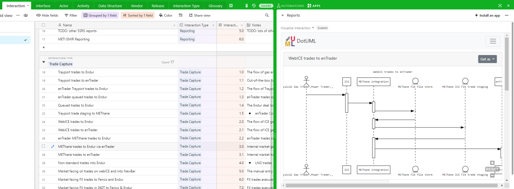
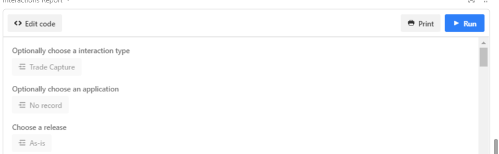

#Enterprise Architecture Reports

## UML Sequence Diagram
A custom Airtable [app](https://airtable.com/developers/apps) has been implemented to visualise an interaction as a [UML Sequence Diagram](https://en.wikipedia.org/wiki/Sequence_diagram). The app works by waiting for a user to select a cell in one of the interaction table rows and converting the interaction definition into a script language that can be rendered as UML. The app uses the services of [dotUML](https://dotuml.com/) to parse and render the diagram.

E.g. clicking on the 'METhane trades to Endur via enTrader' interaction displays as:

## Interactions Reports
A [markdown](https://www.markdownguide.org/) report has been scripted in Airtable to output a textual view of the base.

Running the report prompts the user for:
* An interaction type - optional 
* An application that is involved in the interactions (this includes as a root application) - optional
* Release (e.g. As-Is) - required

The report then produces a recursive markdown report describing the interactions. E.g.

